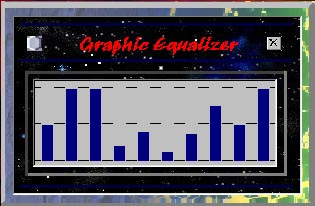



## A\_VisualEqualizerUpgrade

### Description

A Visual Equalizer Upgrade.

This is a

"graphic equalizer"

Great for anyone programming

"MP3 Players"

You must have a Volume Display

(VU Meter) Unit for this code

to function on your system.
 
### More Info
 

             |
---                |---
**Submitted On**   |2000-07-22 22:59:26
**By**             |[Jerrame\_Hertz](https://github.com/Planet-Source-Code/PSCIndex/blob/master/ByAuthor/jerrame-hertz.md)
**Level**          |Intermediate
**User Rating**    |3.4 (24 globes from 7 users)
**Compatibility**  |VB 5\.0, VB 6\.0
**Category**       |[Sound/MP3](https://github.com/Planet-Source-Code/PSCIndex/blob/master/ByCategory/sound-mp3__1-45.md)
**World**          |[Visual Basic](https://github.com/Planet-Source-Code/PSCIndex/blob/master/ByWorld/visual-basic.md)
**Archive File**   |[CODE\_UPLOAD80387232000\.zip](https://github.com/Planet-Source-Code/jerrame-hertz-a-visualequalizerupgrade__1-9975/archive/master.zip)

